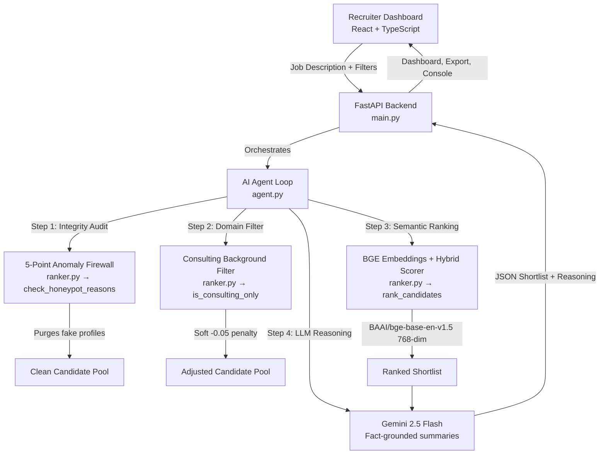

# RecruitShield AI — Autonomous Recruiter Co-Pilot

> 🏆 **Originally built for First Commit Hackathon 2026** — *"Learning is more important than perfection."*
> 🔎 **Extended for SerpApi India Hackathon 2026** with live, evidence-cited employer verification — see [Live Employer Verification](#-live-employer-verification-serpapi).

**RecruitShield AI** is an intelligent candidate discovery and integrity auditing platform that takes a raw candidate database and produces a bias-free, fraud-scrubbed, semantically-ranked shortlist — all powered by an autonomous AI agent loop.

---

## 🌐 Live Deployments

| Service | URL |
|---|---|
| 🚀 Recruiter Dashboard (Vercel) | [beginner-s-paradise-recruitshield.vercel.app](https://beginner-s-paradise-recruitshield.vercel.app) |
| ⚙️ Backend API (Render) | [beginner-s-paradise-recruitshield.onrender.com](https://beginner-s-paradise-recruitshield.onrender.com) |
| 📖 Interactive API Docs | [/docs](https://beginner-s-paradise-recruitshield.onrender.com/docs) |
| 🟢 Health Check | [/health](https://beginner-s-paradise-recruitshield.onrender.com/health) |

---

## 🤖 AI Usage Disclosure

> **Required by First Commit Hackathon rules on AI transparency.**

AI tools were used throughout this project as learning resources and pair-programming aids:

- **Antigravity IDE (powered by Google Gemini / Claude)** — Used for pair-programming, code review, debugging logic errors in the ranking pipeline, and UI polish. All AI suggestions were reviewed, understood, and often modified before being committed.
- **Gemini 2.5 Flash API** — Used in production as the reasoning backbone of the autonomous agent loop (`/chat` endpoint) to generate structured, fact-grounded recruiter summaries from candidate shortlists.
- **BAAI/bge-base-en-v1.5 via Hugging Face** — Used for computing 768-dimensional semantic embeddings for candidate-to-JD similarity matching.

**All core algorithms** — the 5-Point Anomaly Firewall, cosine-similarity hybrid scoring, the consulting penalty logic, and the candidate ranking pipeline — were **designed, understood, and verified by our team**. We can explain every line of code.

---

## 💡 What Problem Does It Solve?

Recruiters face three major pain points:
1. **Fraudulent / honeypot profiles** — fake resumes with logical contradictions that waste interviewer time.
2. **Bias in shortlisting** — manual screening is slow and biased toward prestige brands over actual skills.
3. **No transparency** — black-box ATS systems give no explanation for why a candidate was ranked.

**RecruitShield AI** solves all three by:
- 🛡️ Automatically detecting and purging fake profiles using a custom rule-based 5-Point Anomaly Firewall.
- 🧠 Ranking candidates via semantic embeddings + hybrid scoring — not just keyword matching.
- 📋 Generating factual, zero-hallucination recruiter reasoning for every shortlisted candidate.
- 🔍 Providing a live Agent Execution Console so recruiters can audit *exactly* what the AI did.

---

## 🏗️ System Architecture



---

## ✨ Key Features

### 🛡️ 5-Point Anomaly Firewall
Detects honeypot/fraudulent profiles using 5 hard rules:
1. **Signup date after last-active date** — temporal impossibility
2. **Skill duration exceeds total experience** — skill listed for longer than candidate has worked
3. **Expert skill with 0 months usage** — contradictory proficiency claim
4. **Job start before company founding year** — e.g. "Worked at CRED (founded 2018) from 2015"
5. **Job duration exceeds company age** — worked there longer than the company has existed

### 🧠 Hybrid Neural + Rule-Based Scoring
Final candidate score is a weighted combination of:
- **Semantic Similarity** (768-dim cosine similarity via `BAAI/bge-base-en-v1.5`) — 0.40 weight
- **Skill Match Score** (proficiency × duration × JD skill overlap) — 0.25 weight
- **Title Relevance Score** (dynamic keyword-based title alignment) — 0.20 weight
- **Career History Score** (keyword overlap with job history descriptions) — 0.10 weight
- **Candidate Availability Multiplier** (notice period, activity recency, response rate) — 0.05 weight

### 🤖 Autonomous Agent Console
A live telemetry panel (`/agent_logs`) that lets recruiters see exactly what the AI did — which candidates were purged, why, and what the embedding similarity scores looked like.

### 📊 Dynamic JD-Aware Filtering
Paste any job description and the system dynamically extracts required skills, experience range, location, and work mode to auto-filter and re-rank the candidate pool.

### 📤 One-Click Excel Export
Export the full shortlist with scores and reasoning directly to `.xlsx` for downstream ATS or recruiter use.

### 🔬 Unit-Tested Ranking Logic
Key ranking invariants are verified by a pytest test suite (`tests/test_rank_scoring.py`):
- Honeypots are always excluded
- Scores are bounded 0.0–1.0
- Consulting penalty provably reduces score
- Sorting is always descending by score

---

## 🔎 Live Employer Verification (SerpApi)

> **Pre-existing project disclosure (SerpApi India Hackathon rules):** RecruitShield AI — the ranking pipeline, 5-Point Anomaly Firewall, agent console and dashboard — existed before this hackathon. The work submitted for SerpApi India Hackathon 2026 is the live-verification layer described below (`backend/serp_client.py`, `backend/serp_verifier.py`, the firewall/agent/API integration and `tests/test_serpapi_integration.py`); see the commit history for exactly what changed.

**The gap it closes.** Firewall rules 4 & 5 ("job started before the company existed" / "tenure longer than the company's age") previously relied on a hand-researched table of ~60 employers. Any employer outside that table was silently unverifiable.

**What SerpApi does now.** For an employer that is *not* in the built-in table, the firewall asks Google (via the SerpApi `google` engine) for the company's founding year and uses the Knowledge Graph card as evidence. Every flag it raises cites its source:

```
Worked at NewCo Technologies starting in 2015, but company was founded in 2020.
[live-verified via SerpApi: https://newco.example]
```

**Designed to avoid false purges** (a wrong flag hurts a real candidate):
- The built-in table always wins; live lookups only fill gaps.
- Only a **high-confidence** match — a Knowledge Graph card whose title matches the employer name — can flag a profile. Loose text-snippet matches are reported by the API as *low* confidence and never purge anyone.
- No evidence means **"unknown"**, never "fraud".

**Built for a free quota.** Results (including empty ones) are cached on disk for 30 days, live requests are capped per process (`SERPAPI_MAX_LIVE_CALLS`, default 50), failures never crash the audit, and with no `SERPAPI_API_KEY` the app runs fully offline exactly as before.

| Endpoint | Purpose |
|---|---|
| `GET /serpapi/status` | Is live verification active? Quota used by this process and (if available) remaining on the account. Never returns the key. |
| `GET /serpapi/verify_company?name=<employer>` | Live founding-year lookup with evidence: year, matched entity, source link, confidence. |

Live lookups also appear in the **Agent Execution Console** (`/agent_logs`) as `SERPAPI_VERIFY` events.

**Honest limitations:** only employer founding years are verified live so far (not degrees, skills or titles); coverage depends on whether Google shows a Knowledge Graph card for the employer; and a very small or brand-new company may simply return "unverified".

---

## 📂 Project Structure

```
.
├── README.md                       # This file
├── requirements.txt                # Python backend dependencies
├── pytest.ini                      # Test configuration
├── vercel.json                     # Frontend deployment config
├── Dockerfile                      # Container deployment
│
├── backend/
│   ├── main.py                     # FastAPI server, REST endpoints, startup logic
│   ├── agent.py                    # Autonomous agent — orchestrates audit, filter, rank, reason
│   ├── ranker.py                   # Core scoring engine: honeypot rules, embeddings, hybrid scorer
│   ├── serp_client.py              # SerpApi client: persistent cache, call budget, graceful degradation
│   ├── serp_verifier.py            # Live employer verification (founding year + cited evidence)
│   ├── rank.py                     # Utility ranking functions
│   ├── embed_candidates.py         # Offline BGE embedding pre-computation script
│   └── sample_candidates.jsonl     # Bundled demo candidate dataset (14 profiles)
│
├── frontend/
│   └── src/
│       └── App.tsx                 # Full React + TypeScript dashboard (~5000 lines)
│
└── tests/
    ├── test_rank_scoring.py        # Pytest unit tests for ranking logic
    └── test_serpapi_integration.py # Mocked tests for the SerpApi layer (no network, no quota)
```

---

## 🚀 Getting Started

### Prerequisites
- Python 3.9+
- Node.js 18+ (for frontend development)

### Backend Setup

```bash
# 1. Clone the repository
git clone https://github.com/Parth-kulkarni300/SerpApi-RecruitShield.git
cd SerpApi-RecruitShield

# 2. Create a virtual environment
python -m venv venv
source venv/bin/activate        # macOS / Linux
# .\venv\Scripts\activate       # Windows PowerShell

# 3. Install dependencies
pip install -r requirements.txt

# 4. Set up environment variables
cp .env.example .env
# Edit .env to add your GEMINI_API_KEY and (optional) HF_TOKEN and SERPAPI_API_KEY

# 5. Run the backend
uvicorn backend.main:app --port 8000 --reload
```

Visit:
- **API Docs:** `http://localhost:8000/docs`
- **Health Check:** `http://localhost:8000/health`

### Frontend Setup

```bash
cd frontend
npm install
npm run dev
```

Visit: `http://localhost:5173`

### Run Tests

```bash
pytest tests/ -v
```

### (Optional) Re-generate Embeddings

If you supply your own `candidates.jsonl`, regenerate the embedding index:

```bash
python backend/embed_candidates.py --candidates backend/sample_candidates.jsonl
```

---

## 🔑 Environment Variables

| Variable | Required | Description |
|---|---|---|
| `GEMINI_API_KEY` | Yes | Google Gemini API key for LLM reasoning |
| `HF_TOKEN` | No | Hugging Face token — routes embeddings through HF Inference API instead of loading locally |
| `SERPAPI_API_KEY` | No | SerpApi key — enables live employer verification in the Anomaly Firewall (runs offline without it) |
| `SERPAPI_MAX_LIVE_CALLS` | No | Max live SerpApi requests per server process (default `50`) |
| `CANDIDATES_PATH` | No | Path to your custom `candidates.jsonl` dataset |
| `EMBEDDING_MODEL` | No | Overrides model (default: `BAAI/bge-base-en-v1.5`) |

---

## 🛠️ Tech Stack

| Layer | Technology |
|---|---|
| **Frontend** | React 18, TypeScript, Vite, Recharts, Lucide Icons |
| **Backend** | Python 3.11, FastAPI, Uvicorn |
| **Embeddings** | BAAI/bge-base-en-v1.5 (768-dim), sentence-transformers |
| **LLM** | Google Gemini 2.5 Flash (via `google-genai`) |
| **Data** | NumPy, Pandas, JSONL |
| **Deployment** | Vercel (frontend), Render (backend) |
| **Testing** | Pytest |

---

## 🌱 What We Learned

This was our team's first time building an end-to-end AI-powered full-stack product. Key things we learned:

- **How semantic embeddings work** — understanding cosine similarity, vector normalization, and why `BAAI/bge-base-en-v1.5` outperforms simple keyword matching
- **Autonomous agent design** — how to chain tool calls (audit → filter → rank → reason) in a logical pipeline
- **FastAPI + React integration** — building a real REST API, handling CORS, async startup, and file uploads
- **Why rule-based AI matters** — the honeypot firewall taught us that pure LLM reasoning can hallucinate, but deterministic rules never do
- **Trade-offs in AI deployment** — managing model loading time vs server cold-start, HF API vs local inference

---

## ⚠️ Challenges We Faced

- **Embedding model cold-start** — The `BAAI/bge-base-en-v1.5` model takes 30-60 seconds to load on Render's free tier. Solved by making model loading a background daemon thread so the API stays responsive immediately.
- **Score inflation** — Early versions of the hybrid scorer allowed skill scores to exceed 1.0 due to proficiency multipliers stacking. Fixed by clamping with `min(1.0, ...)`.
- **Concurrency crash** — PyTorch's encoding was not thread-safe on Apple MPS backend; adding an `_ENCODE_LOCK` threading lock fixed a silent process exit.
- **Fake vs legitimate profiles** — Writing the honeypot rules required researching actual company founding years (40+ companies) and edge cases like fictional companies in the dataset.

---

## 👥 Team

**Team Beginner's Paradise**
- Parth Kulkarni — Full-stack development, agent architecture
- Ishika Mahadar - Ranking pipeline

---

## 📜 Credits & External Resources

- [BAAI/bge-base-en-v1.5](https://huggingface.co/BAAI/bge-base-en-v1.5) — Sentence embedding model 
- [sentence-transformers](https://www.sbert.net/) — Python library for BERT-based embeddings
- [Google Gemini API](https://ai.google.dev/) — LLM reasoning for recruiter summaries
- [FastAPI](https://fastapi.tiangolo.com/) — Modern Python web framework
- [Recharts](https://recharts.org/) — React charting library
- [Lucide Icons](https://lucide.dev/) — Icon library

---


